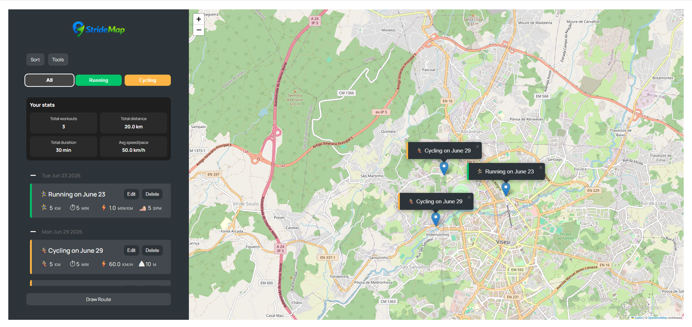
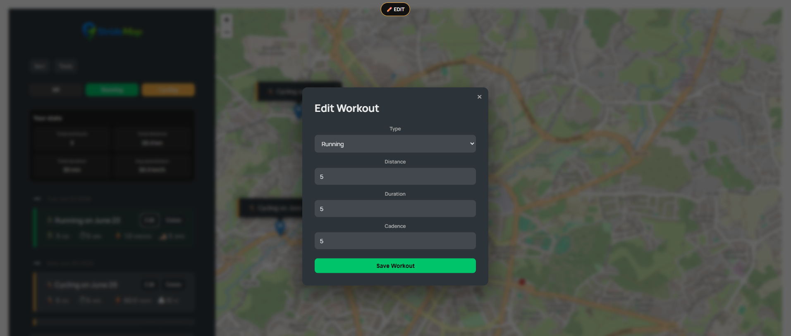
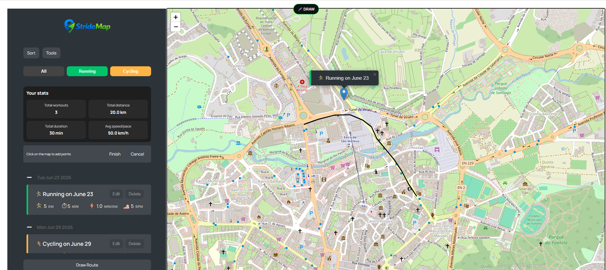

# 🏃‍♂️ Workout Tracker


A modern workout tracking web application built with **Vanilla JavaScript**, **HTML**, **CSS**, and **Leaflet.js**.

This project was developed as a **portfolio application** to deepen my understanding of frontend architecture, object-oriented programming, state management, and browser APIs by building a complete interactive single-page application without frameworks.

---

## 🎥 Live Demo

https://ricardomartins07.github.io/StrideMap/index.html


---

## 📸 Preview


### Main Interface


### Edit Mode


### Draw Route Mode


---

## ✨ Features

### 🗺️ Map & Workouts
- Add workouts by clicking on the map
- Running 🏃‍♂️ and Cycling 🚴 workouts
- Interactive map powered by Leaflet
- Auto-generated workout descriptions
- Select and focus workouts on the map

### ✏️ Management
- Edit existing workouts
- Delete individual or all workouts
- Confirmation modals for destructive actions

### 🧭 Route Drawing
- Draw custom workout routes directly on the map
- Save drawn routes with workouts
- Cancel or finish drawing mode

### 📊 Data & Analytics
- Total distance, duration, and average speed
- Group workouts by date
- Filter by workout type
- Sort by distance, duration, or date

### 💾 Persistence & Data
- LocalStorage persistence
- Export workouts as JSON file
- Import workouts from JSON

### 🎨 UX & UI
- Toast notifications system
- Modal confirmation dialogs
- Multiple UI modes (Normal / Draw / Edit)
- Smooth map interactions and animations

---

## 🧠 Why I Built This

The goal of this project was to move beyond simple DOM manipulation and build a real-world single-page application with a structured architecture, state management, and persistent data handling — using only Vanilla JavaScript.

I focused on:

- Object-Oriented Programming (inheritance, encapsulation)
- Managing complex application state manually
- Handling multiple UI modes in a predictable way
- Working with browser APIs (Geolocation, LocalStorage)
- Building interactive map-based experiences

---

## 🏗️ Architecture Overview
```md


                ┌──────────────┐
                │     App      │
                └──────┬───────┘
                       │
     ┌─────────────────┼─────────────────┐
     │                 │                 │
┌───────────┐   ┌─────────────┐   ┌──────────────┐
│  UI Layer │   │ Map (Leaflet)│   │ State Layer  │
│ (DOM)     │   │             │   │ (Workouts)   │
└───────────┘   └─────────────┘   └──────────────┘
        │                 │                 │
        └──────────┬──────┴──────┬──────────┘
                   │             │
            ┌────────────┐ ┌──────────────┐
            │ LocalStorage│ │ Workout Model│
            └────────────┘ └──────────────┘
                              │
                      ┌──────────────┐
                      │ Running/Cycling │
                      └──────────────┘
```

---

## 🔄 Application Flow
User interacts with the map
↓
Workout or route is created
↓
Workout object is instantiated
↓
UI updates (list + markers)
↓
Data saved to LocalStorage


---

## 📁 Project Structure
```
StrideMap/
│
├── index.html
│
├── css/
│ └── style.css
│
├── js/
│ └── script.js
│
├── assets/
│ ├── screenshots/
│ └── ...
│
└── README.md
```

---

## 🚧 Challenges

One of the biggest challenges was managing multiple UI states (Normal, Draw, Edit) while keeping the application predictable and maintainable.

To solve this, I implemented:

- A centralized state system inside the `App` class
- A UI mode indicator (visual feedback for current state)
- Clear separation between persistent and transient states
- Cleanup functions to reset UI between modes

Another challenge was synchronizing multiple layers of the application:

- Map markers
- Workout list
- Drawn routes
- Persistent storage (LocalStorage)

---

## 🔮 Future Improvements

- Refactor into ES Modules (cleaner architecture)
- Backend integration (Node.js / Firebase)
- User authentication system
- Workout analytics dashboard
- Progressive Web App (PWA)
- Mobile-first UI improvements
- Search functionality for workouts

---

## ⚙️ How to Run

```bash
git clone https://github.com/RicardoMartins07/StrideMap.git
cd StrideMap
open index.html
```
---

## 🧰 Tech Stack
- HTML5
- CSS3
- Vanilla JavaScript (ES6+)
- Leaflet.js
- LocalStorage API
- Geolocation API
